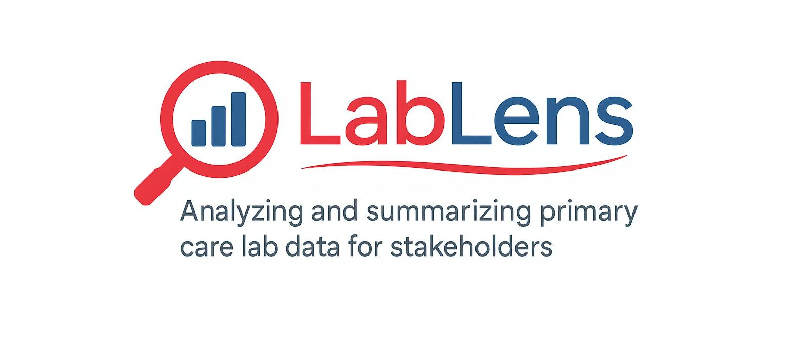

# LabLens - Clinical Lab Results Communication Tool

LabLens is a cross-platform desktop application designed to help clinicians quickly generate patient and staff messages from lab results. The application uses AI to analyze lab result images/PDFs and generates appropriate communication messages for different audiences.

## Features

- **File Upload Support**: Accepts PNG, JPG, and PDF files containing lab results
- **AI-Powered Analysis**: Extracts and interprets lab values from uploaded files using vision-capable LLMs
- **Multi-Provider LLM Support**: Choose between OpenAI and OpenRouter for analysis
- **Settings Panel**: Easy configuration of AI providers and models
- **Dual Message Generation**:
  - **Patient Messages**: Warm, comprehensive messages with lifestyle recommendations (6-8th grade reading level)
  - **Staff Messages**: Clinical format with risk assessment, guidelines, and follow-up plans
- **Trend Analysis**: Compares results across multiple time periods when available
- **Easy Copy-Paste**: One-click copying for seamless workflow integration
- **Fallback Support**: Continues working even without API keys using rule-based messages
- **Cross-Platform**: Works on Mac, Windows, and Linux
- **Portable**: No installation required - just download and run

## Installation

### Prerequisites

- Node.js (version 16 or higher)
- npm (comes with Node.js)

### Development Setup

1. Clone the repository:
```bash
git clone https://github.com/fizt656/LabLens.git
cd LabLens
```

2. Install dependencies:
```bash
npm install
```

3. Run in development mode:
```bash
npm run dev
```

### Building Executables

To build standalone executables for distribution:

```bash
# Build for all platforms
npm run build

# Build for specific platforms
npm run build-mac    # macOS
npm run build-win    # Windows
npm run build-linux  # Linux
```

Built executables will be available in the `dist/` directory.

## Configuration

### LLM API Setup

The application supports multiple LLM providers for lab result analysis:

#### OpenAI (Recommended)

1. Get an API key from [OpenAI](https://platform.openai.com/api-keys)
2. Set the environment variable:
   ```bash
   export OPENAI_API_KEY="your-api-key-here"
   ```
3. In the application settings, select "OpenAI" as your provider
4. The application will use OpenAI's GPT-4o Vision model

#### OpenRouter (Alternative)

1. Get an API key from [OpenRouter](https://openrouter.ai/keys)
2. Set the environment variable:
   ```bash
   export OPENROUTER_API_KEY="your-api-key-here"
   ```
3. In the application settings, select "OpenRouter" as your provider
4. Choose from available models like GPT-4o, Claude 3.5 Sonnet, Gemini Pro Vision, or Llama 3.2 90B Vision

#### Settings Panel

- Click the settings icon (⚙️) in the top-right corner to access configuration
- Switch between OpenAI and OpenRouter providers
- Select specific models when using OpenRouter
- Settings are automatically saved and persist between sessions

#### Development Mode

Without an API key, the application will use mock data based on the sample lab results for testing and development.

## Usage

1. **Launch the Application**: Double-click the executable or run `npm start`

2. **Upload Lab Results**: 
   - Drag and drop a file onto the upload area, or
   - Click the upload area to browse for files
   - Supported formats: PNG, JPG, PDF

3. **Review Analysis**: 
   - The application will automatically analyze the uploaded file
   - Lab values will be displayed with their status (normal, high, low, borderline)

4. **Generate Messages**:
   - Click "Generate Patient Message" for patient-friendly communication
   - Click "Generate Staff Message" for clinical documentation
   - Messages appear side-by-side for easy comparison

5. **Copy and Use**:
   - Click the "Copy" button next to each message
   - Paste directly into your clinical system or communication platform

## Supported Lab Panels

The application can analyze various common lab panels including:

- **Lipid Panel**: Total Cholesterol, LDL, HDL, Triglycerides
- **Basic Metabolic Panel**: Glucose, Sodium, Potassium, Chloride, CO2, BUN, Creatinine
- **Liver Function Tests**: ALT, AST, Bilirubin, Alkaline Phosphatase
- **Thyroid Function**: TSH, T3, T4
- **Complete Blood Count**: WBC, RBC, Hemoglobin, Hematocrit, Platelets

## Message Examples

### Patient Message Sample:
> I'm reaching out about your recent lab results, which show your cholesterol levels are still a bit high, similar to three months ago. Your total cholesterol is 262, and your LDL, sometimes called "bad" cholesterol, is 149. Both of these numbers are higher than we'd like to see. We want your total cholesterol to be under 200 and your LDL under 100. Your triglycerides, another type of fat in your blood, have also gone up slightly to 189, which is just above the normal range of under 150. The good news is your HDL, or "good" cholesterol, looks great at 80, which is even better than it was three months ago. This is helpful for your heart health.
>
> To help bring your cholesterol and triglycerides down, focusing on your diet and exercise will be very important. For diet, try to eat more foods like fruits, vegetables, and whole grains. Foods like oatmeal, beans, and lentils are great because they have fiber that helps lower cholesterol. You should also try to eat more fish like salmon, tuna, or mackerel, which are rich in omega-3s. It's important to cut back on foods high in unhealthy fats, like fried foods, processed snacks, and fatty meats. Limiting sugary drinks and desserts will also help with your triglycerides. For exercise, try to get at least 30 minutes of moderate activity most days of the week, like brisk walking, swimming, or cycling. Even small improvements can make a big difference over time.
>
> We'll want to recheck your labs in about three months to see how these changes are working. Remember, making these lifestyle adjustments is a powerful way to improve your heart health. We're here to support you every step of the way. Please contact our office if you have any questions.

### Staff Message Sample:
> • **Results:**
>   - **Current (2 wk ago) Lipid Panel:**
>     - Total Cholesterol: 262 mg/dL (High; Ref: <200 mg/dL normal)
>     - HDL-C: 80 mg/dL (Normal; Ref: >60 mg/dL optimal)
>     - Triglycerides (TG): 189 mg/dL (Borderline; Ref: <150 mg/dL normal)
>     - LDL-C: 149 mg/dL (High; Ref: <100 mg/dL optimal)
>     - Cholesterol/HDL Ratio: 3.3 (Normal; Ref: Below average risk: <2.34, Average risk: 2.35-4.12)
>     - LDL/HDL Ratio: 1.9 (Normal; Ref: Below average risk: <2.34, Average risk: 2.35-4.12)
>     - Non-HDL-C: 182 mg/dL (High; Ref: <130 mg/dL optimal)
>   - **Previous (3 mo ago) Lipid Panel:**
>     - Total Cholesterol: 260 mg/dL (High; Ref: <200 mg/dL normal)
>     - HDL-C: 70 mg/dL (Normal; Ref: >60 mg/dL optimal)
>     - Triglycerides (TG): 111 mg/dL (Normal; Ref: <150 mg/dL normal)
>     - LDL-C: 166 mg/dL (High; Ref: <100 mg/dL optimal)
>     - Cholesterol/HDL Ratio: 3.7 (Normal; Ref: Below average risk: <2.34, Average risk: 2.35-4.12)
>     - LDL/HDL Ratio: 2.4 (Borderline; Ref: Below average risk: <2.34, Average risk: 2.35-4.12)
>     - Non-HDL-C: 190 mg/dL (High; Ref: <130 mg/dL optimal)
> • **Trends:**
>   - **Total Cholesterol:** Relatively stable (260 mg/dL to 262 mg/dL, +0.77% increase)
>   - **HDL-C:** Increased from 70 mg/dL to 80 mg/dL (+14.28% increase), a favorable trend.
>   - **Triglycerides:** Increased significantly from 111 mg/dL to 189 mg/dL (+70.27% increase), shifting from normal to borderline high. This is a concerning trend.
>   - **LDL-C:** Decreased from 166 mg/dL to 149 mg/dL (-10.24% decrease), a favorable trend, although still significantly elevated.
>   - **Cholesterol/HDL Ratio:** Decreased from 3.7 to 3.3 (-10.81% decrease), indicating improved overall ratio.
>   - **LDL/HDL Ratio:** Decreased from 2.4 to 1.9 (-2

## File Structure

```
LabLens/
├── src/
│   ├── main.js                 # Electron main process
│   ├── renderer/
│   │   ├── index.html         # Main UI
│   │   ├── styles.css         # Application styles
│   │   └── renderer.js        # Frontend logic
│   └── utils/
│       └── llm-analyzer.js    # LLM integration
├── package.json               # Dependencies and scripts
└── README.md                  # This file
```

## Development

### Adding New Lab Panel Support

1. Update the `getAnalysisPrompt()` method in `src/utils/llm-analyzer.js`
2. Add new test name mappings in `formatLabName()` in `src/renderer/renderer.js`
3. Update message generation logic for new lab types

### Customizing Message Templates

Message generation logic is in `src/renderer/renderer.js`:
- `generatePatientMessage()` - Patient-friendly messages
- `generateStaffMessage()` - Clinical staff messages

## Security & Privacy

- All file processing happens locally on your machine
- Lab result images are only sent to the configured LLM API for analysis
- No data is stored permanently by the application
- API keys should be kept secure and not shared

## Troubleshooting

### Common Issues

1. **"Error analyzing lab results"**
   - Check your internet connection
   - Verify API key is set correctly
   - Ensure the uploaded file contains clear, readable lab results

2. **Application won't start**
   - Ensure Node.js is installed (version 16+)
   - Run `npm install` to install dependencies
   - Check console for error messages

3. **Copy function not working**
   - Some systems require clipboard permissions
   - Try manually selecting and copying the text

## Contributing

1. Fork the repository
2. Create a feature branch
3. Make your changes
4. Test thoroughly
5. Submit a pull request

## License

This project is licensed under the GNU General Public License v3.0. See the `LICENSE` file for details.

### Commercial Licensing

For organizations that wish to use LabLens in a commercial product or service but are unable to comply with the terms of the GPLv3, a commercial license is available. Please contact the author, [@fizt656](https://github.com/fizt656), on GitHub to discuss your needs.

## Support

For issues and feature requests, please use the GitHub Issues page.
